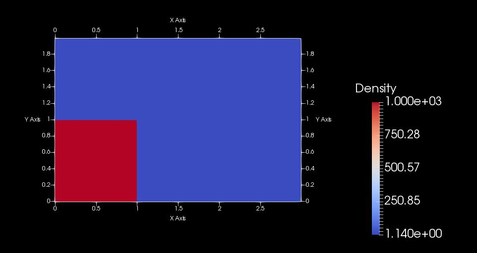

# Creating C++ Interfaces for Fluid Dynamics Simulation
This project is to demonstrate how to create Geometry using C++ APIs. 

#Important:
This code is developed purely with self-interest and not copied from any source.
Also, this code is targeted for people who are willing to learn how to create simple geometries for doing simple fluid simulations.
It is NOT recommended to re-use of any part of the code without author's knowledge and author is not responsible for any bug(s).

# Pre-requistite(s):
1) Computational Fluid Dynamics (Advanced Mechanical Engineering)
2) Linear Algebra, ODEs and PDEs, Numerical Integration 
3) C++ Applicative programming (OOPS Concepts)
4) Data structure and Algorithms

# Tools Required
1) Visual Studio For C++ (For Code Creation, Edition, and to Compile and Build)
2) GitHub Extension for Visual Studio (For Source Code Management (SCM))
3) Paraview for visualization

# Technology Used:
1) C++ 
2) Microsoft - Component Object Modeling (COM)
3) CFD Discretization

To Build:
----------------
1.  Start Microsoft Visual Studio and select **File** \> **Open** \> **CreatingInterfaceGitHub**.
2.  Go to the directory named for the Geometry, and double-click the Geometry.sln file.
3.  Press F5 or use **Build** \> **Build Solution** to build the solution.

    The executable will be built in the default **\\bin** or **\\bin\\Debug** directory.

# Initial State:

A rectangular domain (or a tank) of size 3 x 2 meters containing a total of 300 x  200 particles.
Particles are initially distinct into two different regimes representing water (on the left-bottom) with density 1000 kg/m^3 
and air (on the remaining space) with 1/1000 th of density of water respectively.

# Reference(s)
1) For C++, VS, COM: https://docs.microsoft.com/en-in/
2) NPTEL - IIT Lectures

# Author(s)
Yogeshwaran

