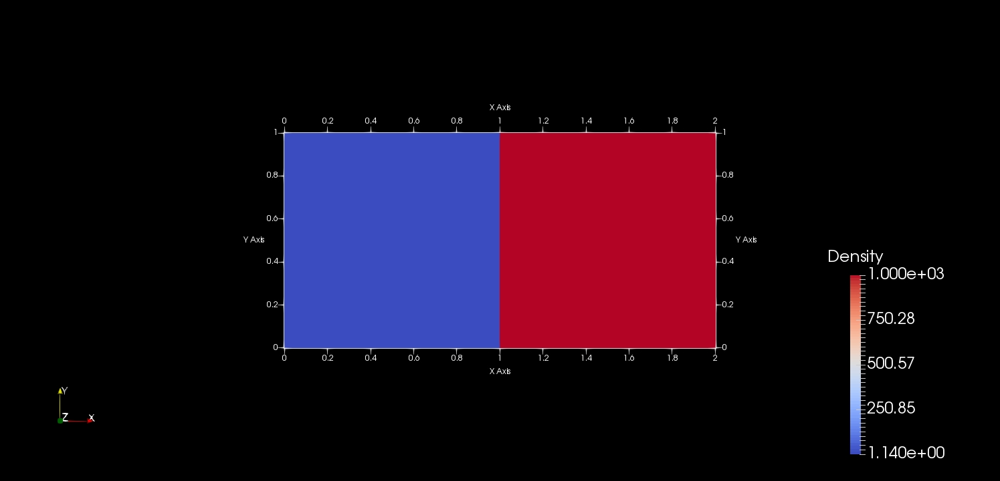

# Creating C++ Interfaces for Fluid Dynamics Simulation
This project is to demonstrate Fluid Dynamics simulation using C++. 

# Pre-requistite(s):
1) Computational Fluid Dynamics (Advanced Mechanical Engineering)
2) Linear Algebra, ODEs and PDEs, Numerical Integration 
3) C++ programming
4) Data structure and Algorithms

# Tools Required
1) Visual Studio For C++ (For Code Creation, Edition, and to Compile and Build)
2) GitHub Extension for Visual Studio (For Source Code Management (SCM))

# Technology Used:
1) C++ 
2) Microsoft - Component Object Modeling (COM)

To Build:
----------------
1.  Start Microsoft Visual Studio and select **File** \> **Open** \> **CreatingInterfaceGitHub**.
2.  Go to the directory named for the Geometry, and double-click the Geometry.sln file.
3.  Press F5 or use **Build** \> **Build Solution** to build the solution.

    The executable will be built in the default **\\bin** or **\\bin\\Debug** directory.

# Initial State:

A rectangular domain (or a tank) of size 2 x 1 meters containing a total of 1001 x 1001 particles.
Particles are initially distinct into two different regimes representing air (on the left) and water (on the right) respectively.

# Reference(s)
1) For C++, VS, COM: https://docs.microsoft.com/en-in/

# Author(s)
Yogeshwaran

